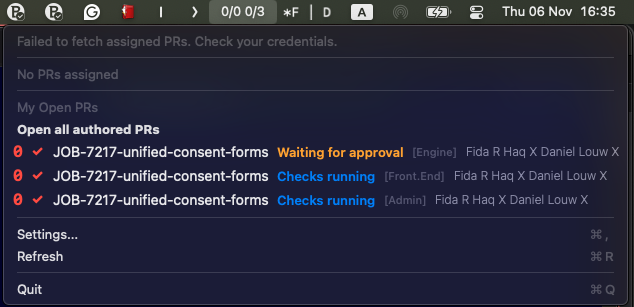
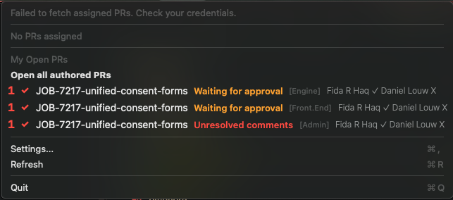
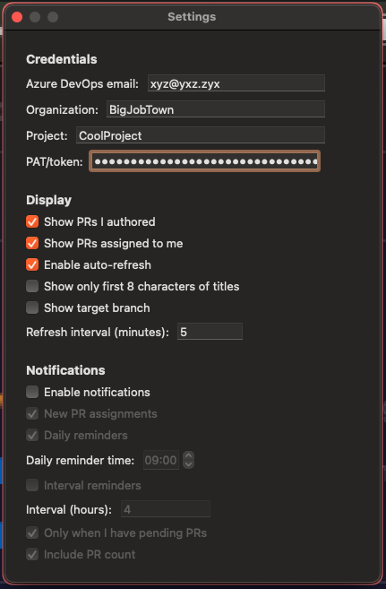

# PRBuster

A macOS menu bar app for managing Azure DevOps Pull Requests with smart notifications and quick access.

---

## Quick Start

1. **Download** the latest release
2. **Configure** your Azure DevOps settings:
   - Email, Organization, Project, Personal Access Token
3. **Done!** See your PRs in the menu bar

---

## What You Get

**Menu Bar Display:** `3/5 2/8`
- **Left**: 3 unapproved out of 5 PRs assigned to you (turns red if overdue)
- **Right**: 2 approved out of 8 PRs you authored

**Smart Features:**
- Red text when you have overdue PRs to review
- Click any PR to open in browser
- "Open all assigned/authored PRs" for batch actions
- Notifications for new assignments and reminders

---

## Configuration

Open Settings from the menu bar and enter:
- **Azure DevOps Email:** Your account email
- **Organization:** Your org name (e.g., `myorg`)
- **Project:** Project name (e.g., `MyProject`)  
- **PAT/Token:** Your Personal Access Token

**Required PAT permissions:** Code: Read & Pull Request: Read & Write

---

## Usage

- Click menu bar icon to view PRs
- Click any PR to open in browser
- Use "Open all assigned PRs" for PRs assigned to you
- Use "Open all authored PRs" for PRs you created
- Access Settings or Refresh from menu

---

## Prerequisites

- macOS 12+
- Azure DevOps account with project access
- Personal Access Token with Code: Read & Pull Request: Read & Write permissions

---

## Development

- Swift/Cocoa (AppKit)
- Main: `main.swift`, `AppDelegate.swift`
- Settings: `Settings/` directory
- PR logic: `PullRequests/` directory
- Notifications: `Notifications/NotificationManager.swift`

---

## Security & Privacy

- Credentials stored in user defaults (not in code)
- No analytics or telemetry
- Only requests network access and file read access

---

## Contributing

Pull requests welcome! For major changes, please open an issue first.

---

## Troubleshooting

- Check credentials and org/project settings if PRs don't appear
- Verify PAT has correct permissions
- Open GitHub issue for problems 