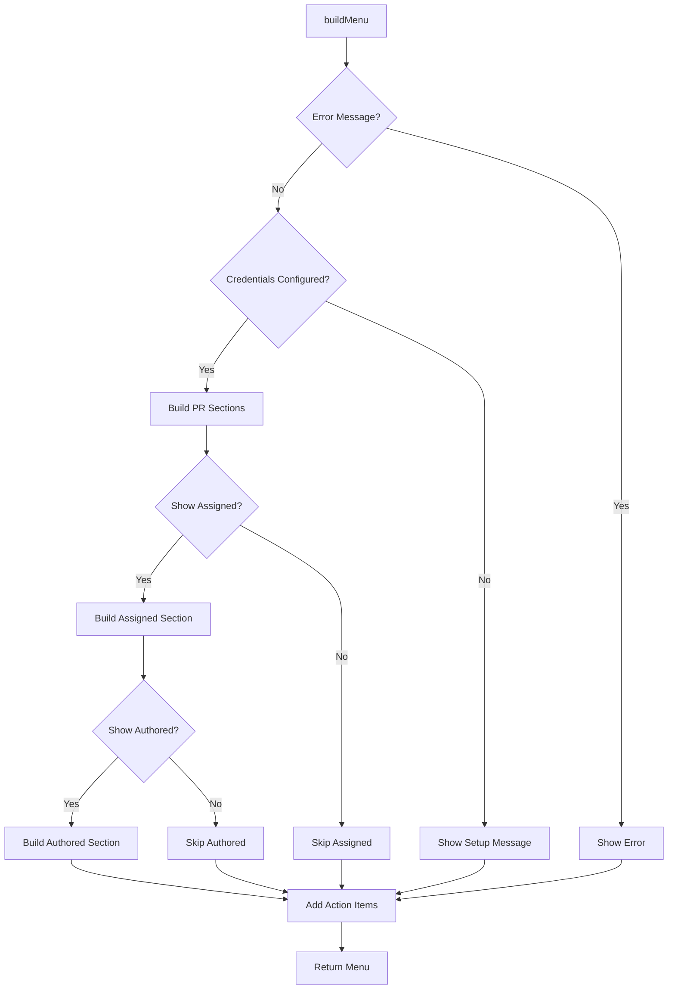

# MenuBuilder Component

## Purpose
Constructs dynamic menu bar menus based on current PR state, user preferences, and error conditions.

## Business Logic

### Menu Construction Strategy
- **Dynamic Content**: Builds menu based on current PR data
- **User Preferences**: Respects display settings for authored/assigned PRs
- **Error Handling**: Shows appropriate messages for error states
- **Batch Operations**: Provides "Open all" functionality for efficiency

### Menu Structure
1. **Error Messages**: Displayed at top if present
2. **Configuration Check**: Shows setup message if credentials missing
3. **Assigned PRs Section**: PRs assigned to the user
4. **Authored PRs Section**: PRs created by the user
5. **Action Items**: Settings, Refresh, Quit

## Key Methods

### `buildMenu`
- **Main Entry Point**: Constructs complete menu from current state
- **Parameter Handling**: Accepts PR data, settings, and action selectors
- **Error Integration**: Incorporates error messages into menu
- **Return Value**: Returns configured NSMenu object

### `openAllAssignedPRs`
- **Batch Operation**: Opens all assigned PRs in browser
- **Menu Parsing**: Extracts URLs from menu items
- **Fallback Logic**: Uses AppDelegate data if menu parsing fails
- **Efficiency**: Reduces repetitive clicking

### `openAllAuthoredPRs`
- **Batch Operation**: Opens all authored PRs in browser
- **Menu Parsing**: Extracts URLs from menu items
- **Fallback Logic**: Uses AppDelegate data if menu parsing fails
- **Efficiency**: Reduces repetitive clicking

## Menu Construction Flow

## Menu Sections

### Error Handling Section
- **Error Display**: Shows error messages when API calls fail
- **Disabled Items**: Error messages are not clickable
- **Separator**: Visual separation from other menu items

### Configuration Section
- **Setup Message**: "Please configure settings" when credentials missing
- **Settings Access**: Direct link to settings window
- **Quit Option**: Always available for app termination

### Assigned PRs Section
- **Section Header**: "Assigned to me" label
- **Batch Action**: "Open all assigned PRs" button
- **Individual PRs**: Each PR as clickable menu item
- **Empty State**: "No PRs assigned" when no data

### Authored PRs Section
- **Section Header**: "My Open PRs" label
- **Batch Action**: "Open all authored PRs" button
- **Individual PRs**: Each PR as clickable menu item
- **Comment Counts**: Shows unresolved comment counts
- **Empty State**: "No PRs authored by me" when no data

### Action Items Section
- **Settings**: Opens settings window
- **Refresh**: Manual data refresh
- **Quit**: Terminates application

## PR Menu Item Construction

### Assigned PR Items
- **Approval Status**: Shows ✓ (approved) or ✗ (not approved)
- **Color Coding**: Green for approved, red for not approved
- **Overdue Indication**: Visual indicator for overdue PRs
- **Click Action**: Opens PR in browser

### Authored PR Items
- **Approval Count**: Shows "X ✓" format for approvals
- **Color Coding**: Green for approved (2+ approvals), red for not approved
- **Reviewer Status**: Shows reviewer names and approval status
- **Comment Counts**: Fetches and displays unresolved comment counts
- **Click Action**: Opens PR in browser

## Batch Operations

### Open All Assigned PRs
- **Menu Parsing**: Iterates through menu items to find PR URLs
- **URL Collection**: Gathers all URLs from assigned PR items
- **Browser Opening**: Opens all URLs in default browser
- **Fallback Logic**: Uses AppDelegate data if menu parsing fails

### Open All Authored PRs
- **Menu Parsing**: Iterates through menu items to find PR URLs
- **URL Collection**: Gathers all URLs from authored PR items
- **Browser Opening**: Opens all URLs in default browser
- **Fallback Logic**: Uses AppDelegate data if menu parsing fails

## Integration Points

### AppDelegate Integration
- **Data Source**: Receives PR data from AppDelegate
- **Settings Access**: Gets user preferences from SettingsManager
- **Action Targets**: Receives action selectors for menu items
- **Error Handling**: Incorporates error messages from AppDelegate

### SettingsManager Integration
- **Display Preferences**: Respects showAuthoredPRs and showAssignedPRs
- **User Configuration**: Adapts menu based on user settings
- **Dynamic Updates**: Menu rebuilds when settings change

### PullRequestService Integration
- **Comment Counts**: Fetches unresolved comment counts for authored PRs
- **Async Updates**: Updates menu items when comment data arrives
- **Error Handling**: Gracefully handles comment count fetch failures

## Error Handling

### Credential Errors
- **Setup Message**: Shows "Please configure settings" when credentials missing
- **Settings Access**: Provides direct link to settings window
- **Graceful Degradation**: App continues to function

### Data Errors
- **Error Display**: Shows error messages in menu
- **Disabled Items**: Error messages are not clickable
- **User Feedback**: Clear indication of what went wrong

### Network Errors
- **Silent Handling**: Continues with empty data
- **User Feedback**: Error messages indicate network issues
- **Retry Option**: Refresh button allows retry

## Performance Considerations

### Menu Construction
- **Efficient Building**: Only constructs necessary menu items
- **Lazy Loading**: Comment counts fetched asynchronously
- **Memory Management**: Proper cleanup of menu items

### Batch Operations
- **Efficient Parsing**: Quick iteration through menu items
- **Fallback Logic**: Uses cached data when menu parsing fails
- **User Experience**: Immediate response to batch actions

## User Experience Features

### Visual Indicators
- **Color Coding**: Green/red for approval status
- **Overdue Highlighting**: Special handling for overdue PRs
- **Comment Counts**: Shows unresolved comment counts
- **Status Icons**: Clear visual indicators for PR status

### Accessibility
- **Accessibility Labels**: Proper labels for screen readers
- **Keyboard Navigation**: Full keyboard support
- **Clear Actions**: Obvious action buttons and menu items

