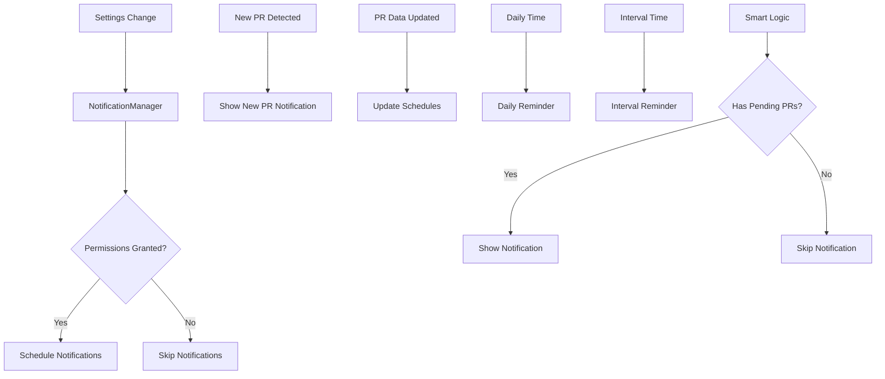

# NotificationManager Component

## Purpose
Manages all notification functionality including permissions, scheduling, and delivery of smart notifications based on PR state.

## Business Logic

### Permission Management
- **Request Permissions**: Asks user for notification permissions when enabled
- **Check Permissions**: Verifies current permission status
- **Graceful Handling**: Continues operation even if permissions denied

### Notification Types

#### New PR Notifications
- **Immediate Delivery**: Shows when new PRs are assigned
- **Individual Notifications**: Single PR notifications with action buttons
- **Batch Notifications**: Multiple PR notifications for efficiency
- **Action Integration**: "Open PR" button in notifications

#### Reminder Notifications
- **Daily Reminders**: Scheduled at user-specified time
- **Interval Reminders**: Periodic reminders based on user settings
- **Smart Logic**: Only shows when there are pending PRs (if enabled)

### Smart Notification Features
- **Context Awareness**: Only notifies when there are actual pending PRs
- **PR Count Integration**: Includes current PR count in messages
- **User Preferences**: Respects all notification settings

## Key Methods

### Permission Management
- **`requestNotificationPermissions`**: Requests notification permissions from user
- **`checkNotificationPermissions`**: Checks current permission status
- **Error Handling**: Logs permission errors and continues operation

### Scheduling Methods
- **`scheduleDailyReminder`**: Sets up daily reminder notifications
- **`scheduleIntervalReminder`**: Sets up periodic reminder notifications
- **`removeDailyReminder`**: Cancels daily reminder notifications
- **`removeIntervalReminder`**: Cancels interval reminder notifications

### New PR Notifications
- **`showNewPRNotification`**: Shows notification for single new PR
- **`showBatchNewPRNotification`**: Shows notification for multiple new PRs
- **Action Integration**: Includes "Open PR" action button

### Management Methods
- **`updateNotificationSchedules`**: Updates all notification schedules
- **`clearAllNotifications`**: Removes all delivered and pending notifications
- **`getPendingPRCount`**: Gets current PR count from AppDelegate

## Notification Flow

## Notification Content

### Daily Reminders
- **Title**: "PR Review Reminder"
- **Body**: "You have X pull request(s) to review" (if count enabled)
- **Alternative**: "Time to review your pull requests" (if count disabled)
- **Sound**: Default notification sound

### Interval Reminders
- **Title**: "PR Review Check-in"
- **Body**: "You have X pull request(s) to review" (if count enabled)
- **Alternative**: "Check your pull requests" (if count disabled)
- **Sound**: Default notification sound

### New PR Notifications
- **Title**: "New PR Assigned" (single) or "New Pull Requests" (batch)
- **Body**: PR title and author (single) or count (batch)
- **Action**: "Open PR" button for immediate access
- **Sound**: Default notification sound

## Smart Notification Logic

### Context Awareness
- **Pending PR Check**: Only shows reminders when there are pending PRs
- **User Preference**: Respects "smart notifications" setting
- **Efficient Scheduling**: Avoids unnecessary notifications

### PR Count Integration
- **Dynamic Content**: Includes current PR count in messages
- **User Control**: Respects "include PR count" setting
- **Accurate Counts**: Gets real-time count from AppDelegate

## Integration Points

### AppDelegate Integration
- **Permission Requests**: Triggered when notifications are enabled
- **Schedule Updates**: Called when PR data changes
- **PR Count Access**: Gets current PR count for smart notifications

### SettingsManager Integration
- **Permission Control**: Master toggle for all notifications
- **Individual Settings**: Granular control over notification types
- **Smart Logic**: Settings for context-aware notifications

### UNUserNotificationCenter Integration
- **Delegate Implementation**: Handles notification presentation and actions
- **Foreground Display**: Shows notifications even when app is active
- **Action Handling**: Processes "Open PR" button taps

## Error Handling

### Permission Errors
- **Graceful Degradation**: Continues operation if permissions denied
- **User Feedback**: Logs permission errors for debugging
- **Retry Logic**: Can request permissions again when settings change

### Scheduling Errors
- **Error Logging**: Logs scheduling errors to console
- **Continue Operation**: App continues to function if scheduling fails
- **User Experience**: Notifications are optional, not critical

### Action Handling
- **URL Validation**: Ensures PR URLs are valid before opening
- **Fallback Behavior**: Graceful handling of invalid URLs
- **User Feedback**: Immediate response to action taps

## Configuration Dependencies

### Settings Integration
- **Master Toggle**: `notificationsEnabled` controls all notifications
- **Individual Types**: Separate toggles for each notification type
- **Timing Settings**: Daily time and interval hours
- **Smart Features**: Smart notifications and PR count inclusion

### Dynamic Updates
- **Real-time Changes**: Updates schedules when settings change
- **Permission Changes**: Responds to permission grant/denial
- **PR State Changes**: Updates schedules when PR data changes

## Security Considerations

### Privacy
- **Local Processing**: All notification logic runs locally
- **No Data Sharing**: No external data transmission
- **User Control**: User controls all notification settings

### Permissions
- **Minimal Requests**: Only requests necessary notification permissions
- **User Choice**: User can disable all notifications
- **Transparent**: Clear indication of what notifications will be shown

