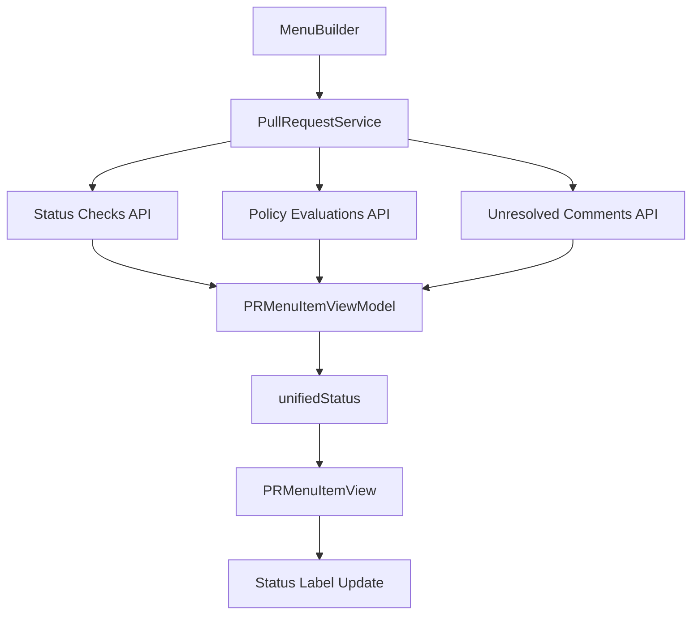

# PRMenuItemViewModel Component

## Purpose
Manages dynamic UI state for individual PR menu items, separating immutable PullRequest data from mutable status information that is fetched asynchronously.

## Business Logic

### State Management
- **Immutable PR Data**: Stores reference to immutable PullRequest struct
- **Mutable Status State**: Tracks dynamically fetched status information
- **Status Precedence**: Centralized logic for determining priority status
- **Async Updates**: State updates as API data arrives

### Status Information Tracked

#### Build Validation State
- **Source**: Policy Evaluations API
- **States**: `approved`, `rejected`, `queued`, `pending`, `succeeded`, `failed`, `error`
- **Purpose**: Determines if build validation has passed or failed

#### Reviewers Policy State
- **Source**: Policy Evaluations API
- **States**: `queued`, `approved`, `rejected`, `unknown`
- **Purpose**: Determines if reviewers policy requirements are met

#### Unresolved Comment Count
- **Source**: Unresolved Comments API
- **Type**: Integer count
- **Purpose**: Shows number of active comment threads requiring attention

#### Check Running Status
- **Source**: Status Checks API
- **Type**: Boolean
- **Purpose**: Indicates if any status checks are currently running

#### Build Validation Expiration
- **Source**: Policy Evaluations API
- **Type**: Boolean
- **Purpose**: Indicates if build validation has expired

#### Build Failure Reason
- **Source**: Policy Evaluations API (buildOutputPreview)
- **Type**: Optional String
- **Purpose**: Provides specific failure reason (e.g., "branch behind check")

## Status Precedence Logic

The `unifiedStatus` computed property implements prioritized status display:

```swift
Priority Order (Highest to Lowest):
1. Build validation expired (RED)
2. Build validation failed (RED)
3. Unresolved comments (RED)
4. Checks running (BLUE)
5. Waiting for reapproval (ORANGE)
6. Waiting for approval (ORANGE)
7. Ready for completion (GREEN)
```

### Status Determination Rules

#### 1. Build Expired (Highest Priority)
- **Condition**: `buildValidationExpired == true`
- **Color**: RED
- **Message**: "Build validation expired"

#### 2. Build Failed
- **Condition**: `buildValidationState == .failed || .error`
- **Color**: RED
- **Message**: "Build validation failed" (with optional reason)

#### 3. Unresolved Comments
- **Condition**: `unresolvedCommentCount > 0`
- **Color**: RED
- **Message**: "Unresolved comments"

#### 4. Checks Running
- **Condition**: `buildValidationState == .pending` OR no status yet
- **Color**: BLUE
- **Message**: "Checks running"

#### 5. Waiting for Reapproval
- **Condition**: `buildValidationState == .succeeded` AND `reviewersPolicyState == .rejected`
- **Color**: ORANGE
- **Message**: "Waiting for reapproval"

#### 6. Waiting for Approval
- **Condition**: `buildValidationState == .succeeded` AND (`reviewersPolicyState == .queued` OR approval count < 2)
- **Color**: ORANGE
- **Message**: "Waiting for approval"

#### 7. Ready (Default)
- **Condition**: `buildValidationState == .succeeded` AND `reviewersPolicyState == .approved` AND approval count >= 2
- **Color**: GREEN
- **Message**: "Ready"

## Key Methods

### Initialization
- **init(pr:)**: Creates view model with immutable PR reference
- **State Initialization**: All mutable state starts as nil/false/default values

### State Properties

#### buildValidationState
- **Type**: `PRStatusCheck.State?`
- **Updates**: Set by MenuBuilder after Policy Evaluations API fetch
- **Usage**: Determines build validation status

#### reviewersPolicyState
- **Type**: `ReviewersPolicyState`
- **Updates**: Set by MenuBuilder after Policy Evaluations API fetch
- **Usage**: Determines reviewers policy status

#### unresolvedCommentCount
- **Type**: `Int`
- **Updates**: Set by MenuBuilder after Unresolved Comments API fetch
- **Usage**: Count of unresolved comment threads

#### isAnyCheckRunning
- **Type**: `Bool`
- **Updates**: Set by MenuBuilder after Status Checks API fetch
- **Usage**: Indicates if checks are in progress

#### buildValidationExpired
- **Type**: `Bool`
- **Updates**: Set by MenuBuilder after Policy Evaluations API fetch
- **Usage**: Indicates if build validation has expired

#### buildFailedReason
- **Type**: `String?`
- **Updates**: Set by MenuBuilder after Policy Evaluations API fetch (parsed from buildOutputPreview)
- **Usage**: Provides specific failure reason for display

### Computed Properties

#### unifiedStatus
- **Type**: `PullRequest.PRUnifiedStatus`
- **Purpose**: Determines the single status to display based on precedence
- **Logic**: Implements priority ordering as described above
- **Returns**: Highest priority status from current state

#### failedOrExpired
- **Type**: `Bool`
- **Purpose**: Quick check if PR has failed or expired build validation
- **Usage**: Helper for conditional logic

## Integration Points

### MenuBuilder Integration
- **State Updates**: MenuBuilder updates view model state after each API fetch
- **Status Display**: MenuBuilder queries `unifiedStatus` to display current status
- **Async Coordination**: View model state updates trigger UI updates on main thread

### PullRequestService Integration
- **Data Source**: View model receives data from PullRequestService API methods
- **Multiple Sources**: Aggregates data from Status Checks, Policy Evaluations, and Comments APIs
- **State Reconciliation**: Combines data from multiple async sources

### PRMenuItemView Integration
- **Status Display**: PRMenuItemView calls `updateStatus(text:color:)` based on view model's unifiedStatus
- **Real-time Updates**: Status label updates as view model state changes
- **UI Coordination**: View model provides single source of truth for status display

## Data Flow



## State Update Flow

1. **Initial State**: View model created with nil/default values
2. **Status Checks Fetch**: `buildValidationState` and `isAnyCheckRunning` updated
3. **Policy Evaluations Fetch**: `reviewersPolicyState`, `buildValidationExpired`, `buildFailedReason` updated
4. **Comments Fetch**: `unresolvedCommentCount` updated
5. **Status Computation**: `unifiedStatus` recalculated (computed property)
6. **UI Update**: PRMenuItemView updates status label on main thread

## Error Handling

### Missing API Data
- **Graceful Degradation**: Defaults to lower priority statuses when data missing
- **Unknown States**: Falls back to "Checks running" when state is unclear
- **Partial Data**: Uses available data for status determination

### API Failures
- **Silent Handling**: Continues with existing state when API calls fail
- **No State Reset**: Doesn't clear state on failure (maintains last known state)
- **User Experience**: UI shows last known status rather than error

## Performance Considerations

### Computed Property Efficiency
- **Lazy Evaluation**: `unifiedStatus` computed only when accessed
- **Minimal Computation**: Simple conditional logic for fast execution
- **No Caching**: Always reflects current state (always accurate)

### Memory Management
- **Reference to PR**: Holds reference to immutable PullRequest (memory efficient)
- **Minimal State**: Only stores essential status information
- **No Retain Cycles**: Weak references where appropriate

## Architecture Benefits

### Separation of Concerns
- **Immutable Data**: PullRequest struct remains unchanged
- **Mutable State**: Status information managed separately
- **Single Responsibility**: Focused on status determination logic

### Testability
- **State Injection**: Easy to test with mock state values
- **Deterministic Logic**: Status precedence logic is pure and testable
- **Isolated Testing**: Can test status logic without API dependencies

### Maintainability
- **Centralized Logic**: All status precedence in one place
- **Clear Rules**: Explicit priority ordering easy to understand
- **Extensible**: Easy to add new status types or change priorities

