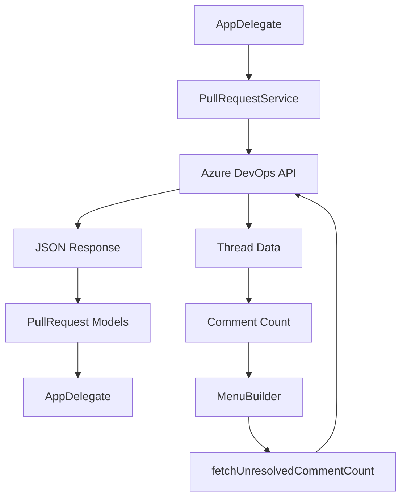

# PullRequestService Component

## Purpose
Handles all Azure DevOps API interactions for fetching pull request data, including assigned PRs, authored PRs, and comment counts.

## Business Logic

### API Integration
- **Authentication**: Uses Personal Access Token (PAT) with Basic authentication
- **Endpoint Management**: Constructs Azure DevOps API URLs dynamically
- **Error Handling**: Graceful handling of network errors and API failures
- **Data Parsing**: Converts JSON responses to Swift models

### Data Fetching Strategy
- **Assigned PRs**: Fetches PRs where user is a reviewer
- **Authored PRs**: Fetches PRs created by the user
- **Comment Counts**: Fetches unresolved comment counts for authored PRs
- **Filtering**: Client-side filtering for assigned PRs by email

## Key Methods

### `fetchAssignedPRs`
- **Purpose**: Retrieves PRs assigned to the current user
- **API Endpoint**: `/git/pullrequests?searchCriteria.reviewerId=me&status=active`
- **Authentication**: Uses PAT with Basic auth (empty username, PAT as password)
- **Filtering**: Filters results by user's email address
- **Completion**: Returns array of PullRequest objects

### `fetchAuthoredPRs`
- **Purpose**: Retrieves PRs created by the current user
- **API Endpoint**: `/git/pullrequests?searchCriteria.creatorId=me&status=active`
- **Authentication**: Uses PAT with Basic auth
- **No Filtering**: Returns all authored PRs (no additional filtering needed)
- **Completion**: Returns array of PullRequest objects

### `fetchUnresolvedCommentCount`
- **Purpose**: Gets count of unresolved comments for a specific PR
- **API Endpoint**: `/git/repositories/{repoId}/pullRequests/{prId}/threads`
- **Filtering**: Filters threads by "active" status
- **Completion**: Returns integer count of unresolved comments

## API Integration Details

### Authentication Method
```swift
let authStr = ":\(pat)"
let authData = authStr.data(using: .utf8)!
let authValue = "Basic \(authData.base64EncodedString())"
request.setValue(authValue, forHTTPHeaderField: "Authorization")
```

### URL Construction
- **Base URL**: `https://dev.azure.com/{organization}/{project}/_apis`
- **API Version**: `7.1-preview.1` for PR endpoints, `7.1` for threads
- **Dynamic Parameters**: Organization and project from settings

### Response Handling
- **JSON Decoding**: Uses `JSONDecoder` with custom models
- **Error Recovery**: Returns empty arrays on decode failures
- **Data Validation**: Checks for empty responses

## Data Flow



## Error Handling

### Network Errors
- **Timeout Handling**: URLSession handles timeouts automatically
- **Connection Issues**: Returns empty arrays on network failures
- **Invalid URLs**: Guard statements prevent invalid URL construction

### API Errors
- **Authentication Failures**: Returns empty arrays (handled by AppDelegate)
- **Permission Issues**: Silent failure with empty results
- **Rate Limiting**: Relies on URLSession's built-in retry logic

### Data Parsing Errors
- **JSON Decode Failures**: Catches and logs decode errors
- **Missing Fields**: Models handle optional fields gracefully
- **Type Mismatches**: Strong typing prevents runtime errors

## Integration Points

### AppDelegate Integration
- **Credential Passing**: Receives email and PAT from SettingsManager
- **Async Completion**: Uses completion handlers for async operations
- **Main Thread**: Ensures UI updates happen on main thread

### MenuBuilder Integration
- **Comment Counts**: Fetches unresolved comment counts for authored PRs
- **Async Updates**: Updates menu items asynchronously when data arrives
- **Error Handling**: Gracefully handles comment count fetch failures

## Performance Considerations

### Caching Strategy
- **No Local Caching**: Relies on Azure DevOps API caching
- **Refresh Intervals**: Controlled by user settings
- **Efficient Requests**: Only fetches active PRs

### Network Optimization
- **Concurrent Requests**: Assigned and authored PRs fetched in parallel
- **Minimal Data**: Only fetches necessary fields
- **Error Recovery**: Quick failure for invalid requests

## Security Considerations

### Credential Handling
- **PAT Storage**: Credentials stored securely in UserDefaults
- **Network Transmission**: HTTPS for all API calls
- **No Logging**: Credentials not logged or exposed

### API Permissions
- **Required Permissions**: Code: Read, Pull Request: Read & Write
- **Minimal Scope**: Only requests necessary permissions
- **User Control**: User manages their own PAT

## Configuration Dependencies

### SettingsManager Integration
- **Organization**: Used in API URL construction
- **Project**: Used in API URL construction
- **Credentials**: Email and PAT for authentication

### Dynamic Configuration
- **URL Construction**: Builds URLs based on current settings
- **Authentication**: Uses current PAT for all requests
- **Error Handling**: Adapts to credential changes

