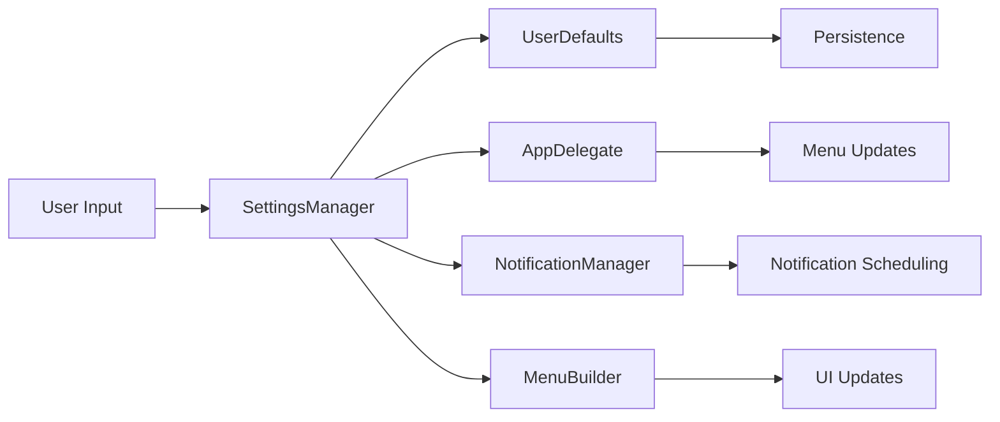

# SettingsManager Component

## Purpose
Centralized settings management with persistence, providing a single source of truth for all application configuration.

## Business Logic

### Settings Architecture
- **ObservableObject**: Uses SwiftUI's ObservableObject for reactive updates
- **Persistence**: Automatically saves settings to UserDefaults on changes
- **Backward Compatibility**: Maintains legacy UserDefaults keys for migration
- **Default Values**: Provides sensible defaults for all settings

### Configuration Categories

#### Azure DevOps Credentials
- **Email**: User's Azure DevOps email address
- **PAT**: Personal Access Token for API authentication
- **Organization**: Azure DevOps organization name
- **Project**: Project name within the organization

#### Display Preferences
- **Show Authored PRs**: Toggle visibility of authored PRs in menu
- **Show Assigned PRs**: Toggle visibility of assigned PRs in menu
- **Auto-refresh**: Enable/disable automatic data refresh
- **Refresh Interval**: Time between automatic refreshes (in seconds)

#### Notification Settings
- **Notifications Enabled**: Master toggle for all notifications
- **New PR Notifications**: Notify when new PRs are assigned
- **Daily Reminders**: Schedule daily reminder notifications
- **Interval Reminders**: Schedule periodic reminder notifications
- **Smart Notifications**: Only notify when there are pending PRs
- **Include PR Count**: Include PR count in notification messages
- **Daily Reminder Time**: Time of day for daily reminders
- **Interval Hours**: Hours between interval reminders

## Key Methods

### Settings Access
- **Computed Properties**: Direct access to individual settings
- **Type Safety**: Strongly typed access to all configuration values
- **Reactive Updates**: Automatic UI updates when settings change

### Persistence
- **JSON Encoding**: Serializes settings to JSON for storage
- **Legacy Support**: Maintains backward compatibility with old format
- **Error Handling**: Graceful fallback to defaults on decode errors

### Configuration Validation
- **isConfigured**: Checks if required credentials are present
- **Empty Checks**: Validates that email and PAT are not empty
- **Default Values**: Provides fallback values for missing settings

## Data Flow



## Settings Structure

### AppSettings Model
```swift
struct AppSettings: Codable {
    var azureEmail: String
    var azurePAT: String
    var showAuthoredPRs: Bool
    var showAssignedPRs: Bool
    var refreshInterval: Int
    var autoRefreshEnabled: Bool
    var notificationsEnabled: Bool
    var newPRNotifications: Bool
    var dailyReminders: Bool
    var intervalReminders: Bool
    var dailyReminderTime: Date
    var intervalHours: Int
    var smartNotifications: Bool
    var includePRCount: Bool
    var organization: String
    var project: String
}
```

## Persistence Strategy

### Primary Storage
- **JSON Encoding**: Settings stored as JSON in UserDefaults
- **Key**: "AppSettings" for the JSON data
- **Automatic Save**: Settings saved immediately on change

### Legacy Support
- **Individual Keys**: Maintains individual UserDefaults keys
- **Migration**: Automatically migrates from old format
- **Fallback**: Uses legacy keys if JSON decode fails

## Integration Points

### AppDelegate Integration
- **Credential Validation**: AppDelegate checks `isConfigured` before starting
- **Refresh Control**: Controls auto-refresh timer based on settings
- **Menu Updates**: Triggers menu rebuilds when display settings change

### NotificationManager Integration
- **Permission Requests**: Controls when to request notification permissions
- **Schedule Updates**: Triggers notification schedule updates
- **Smart Logic**: Provides settings for smart notification behavior

### SettingsWindowController Integration
- **Bidirectional Binding**: Settings window reads from and writes to manager
- **Real-time Updates**: Changes immediately reflected in app behavior
- **Validation**: Ensures settings are valid before saving

## Error Handling

### Decode Errors
- **Graceful Fallback**: Uses default settings if JSON decode fails
- **Legacy Migration**: Attempts to load from individual UserDefaults keys
- **Error Logging**: Logs decode errors for debugging

### Save Errors
- **Error Logging**: Logs save errors to console
- **Continue Operation**: App continues to function even if save fails
- **User Feedback**: Settings changes still take effect in memory

## Default Values

### Credentials
- **Email**: Empty string (requires user input)
- **PAT**: Empty string (requires user input)
- **Organization**: "jobjack" (example default)
- **Project**: "Platform" (example default)

### Display
- **Show Authored PRs**: true
- **Show Assigned PRs**: true
- **Auto-refresh**: true
- **Refresh Interval**: 60 seconds (1 minute)

### Notifications
- **Notifications Enabled**: false (opt-in)
- **New PR Notifications**: true
- **Daily Reminders**: true
- **Interval Reminders**: false
- **Smart Notifications**: true
- **Include PR Count**: true
- **Daily Reminder Time**: 9:00 AM
- **Interval Hours**: 4 hours

