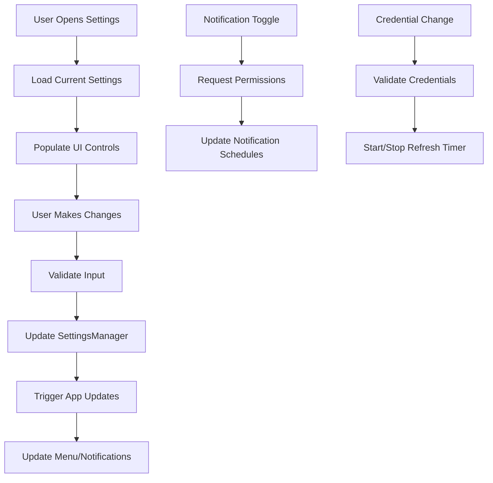

# SettingsWindowController Component

## Purpose
Provides a comprehensive settings interface for configuring all application preferences, including credentials, display options, and notification settings.

## Business Logic

### Window Management
- **Singleton Pattern**: Single instance managed through static property
- **Modal Display**: Can be shown modally or as regular window
- **Auto-layout**: Uses NSStackView for responsive layout
- **Window Delegation**: Handles window closing and cleanup

### Settings Categories

#### Credentials Section
- **Azure DevOps Email**: Text field for user's email address
- **Organization**: Text field for organization name
- **Project**: Text field for project name
- **PAT/Token**: Secure text field for Personal Access Token

#### Display Section
- **Show Authored PRs**: Checkbox to toggle authored PR visibility
- **Show Assigned PRs**: Checkbox to toggle assigned PR visibility
- **Auto-refresh**: Checkbox to enable/disable automatic refresh
- **Refresh Interval**: Text field for refresh interval in minutes

#### Notifications Section
- **Enable Notifications**: Master toggle for all notifications
- **New PR Notifications**: Toggle for new PR assignment notifications
- **Daily Reminders**: Toggle for daily reminder notifications
- **Interval Reminders**: Toggle for periodic reminder notifications
- **Smart Notifications**: Toggle for context-aware notifications
- **Include PR Count**: Toggle for PR count in notifications
- **Daily Reminder Time**: Time picker for daily reminder time
- **Interval Hours**: Text field for interval reminder frequency

## Key Methods

### Initialization
- **Window Creation**: Creates window with appropriate size and style
- **Layout Setup**: Configures NSStackView layout with proper constraints
- **Control Creation**: Creates all UI controls with appropriate properties
- **Target/Action Setup**: Connects controls to action methods

### Settings Management
- **Load Settings**: Reads current settings from SettingsManager
- **Save Settings**: Writes settings changes to SettingsManager
- **Real-time Updates**: Updates app behavior immediately on changes
- **Validation**: Ensures settings are valid before saving

### Control Management
- **Enable/Disable Logic**: Controls are enabled/disabled based on dependencies
- **State Synchronization**: UI state reflects current settings
- **Change Handling**: Responds to user input with appropriate actions

## Settings Flow

## UI Layout Structure

### Main Container
- **NSStackView**: Vertical stack view with 24pt spacing
- **Edge Insets**: 24pt margins on all sides
- **Alignment**: Leading alignment for consistent layout
- **Constraints**: Full-width, flexible height

### Credentials Section
- **Section Label**: "Credentials" in bold
- **Email Row**: Label + text field
- **Organization Row**: Label + text field
- **Project Row**: Label + text field
- **PAT Row**: Label + secure text field

### Display Section
- **Section Label**: "Display" in bold
- **Checkboxes**: Show authored/assigned PRs, auto-refresh
- **Refresh Interval**: Label + text field (enabled when auto-refresh on)

### Notifications Section
- **Section Label**: "Notifications" in bold
- **Master Toggle**: Enable notifications checkbox
- **Sub-toggles**: Individual notification type checkboxes
- **Time Controls**: Daily reminder time picker, interval hours field
- **Smart Features**: Smart notifications, include PR count

## Control Dependencies

### Auto-refresh Dependencies
- **Refresh Interval**: Only enabled when auto-refresh is checked
- **Real-time Updates**: App behavior changes immediately

### Notification Dependencies
- **Sub-toggles**: Only enabled when notifications are enabled
- **Time Controls**: Only enabled when respective reminder types are on
- **Permission Requests**: Triggered when notifications are enabled

### Credential Dependencies
- **App Behavior**: Menu updates when credentials change
- **Timer Control**: Refresh timer starts/stops based on credentials
- **Error Handling**: Error messages clear when credentials are valid

## Integration Points

### SettingsManager Integration
- **Bidirectional Binding**: Reads from and writes to SettingsManager
- **Real-time Updates**: Changes immediately reflected in app
- **Persistence**: Settings automatically saved to UserDefaults

### AppDelegate Integration
- **Menu Updates**: Triggers menu rebuilds when settings change
- **Timer Control**: Starts/stops refresh timer based on settings
- **Notification Updates**: Updates notification schedules

### NotificationManager Integration
- **Permission Requests**: Triggers permission requests when notifications enabled
- **Schedule Updates**: Updates notification schedules when settings change
- **Smart Logic**: Provides settings for smart notification behavior

## Error Handling

### Input Validation
- **Numeric Fields**: Validates refresh interval and interval hours
- **Date Fields**: Ensures valid time picker values
- **Required Fields**: Handles empty credential fields gracefully

### Permission Errors
- **Notification Permissions**: Handles permission denial gracefully
- **User Feedback**: Clear indication of permission status
- **Fallback Behavior**: App continues to function without notifications

### Window Management
- **Cleanup**: Proper cleanup when window closes
- **Memory Management**: Releases window controller reference
- **Modal Handling**: Stops modal sessions appropriately

## User Experience Features

### Responsive Layout
- **Auto-layout**: Adapts to different window sizes
- **Constraint Management**: Proper constraints for all controls
- **Spacing**: Consistent spacing and alignment

### Control States
- **Enable/Disable Logic**: Controls enabled/disabled based on dependencies
- **Visual Feedback**: Clear indication of control states
- **Keyboard Navigation**: Full keyboard support for all controls

### Accessibility
- **Labels**: Proper labels for all controls
- **Tooltips**: Helpful tooltips for complex controls
- **Screen Reader**: Compatible with accessibility features

## Performance Considerations

### Memory Management
- **Window Lifecycle**: Proper cleanup when window closes
- **Control References**: Weak references where appropriate
- **Event Handling**: Efficient event handling for all controls

### Update Efficiency
- **Batched Updates**: Groups related setting changes
- **Minimal Rebuilds**: Only rebuilds necessary components
- **Async Operations**: Handles permission requests asynchronously

## Security Considerations

### Credential Handling
- **Secure Text Field**: PAT field uses secure text input
- **No Logging**: Credentials not logged or exposed
- **Local Storage**: Credentials stored securely in UserDefaults

### Input Validation
- **Sanitization**: Validates all user input
- **Type Safety**: Strong typing for all settings
- **Error Prevention**: Prevents invalid settings from being saved

