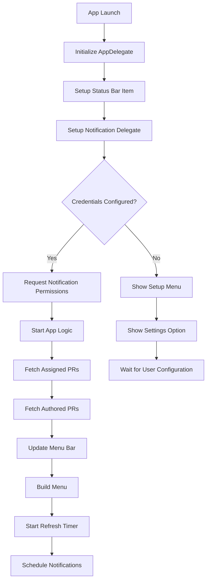
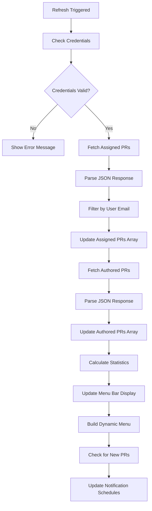
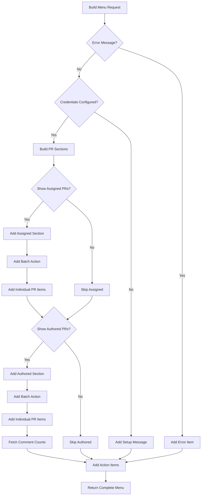
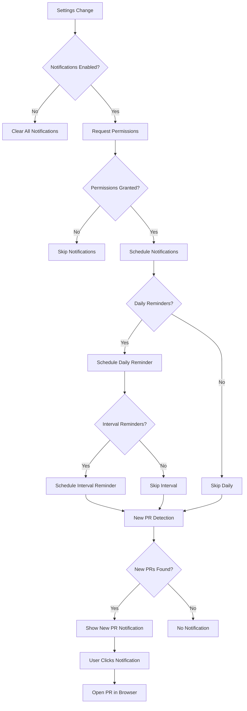
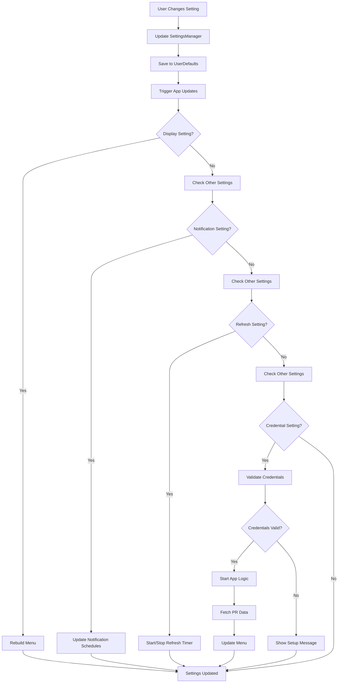
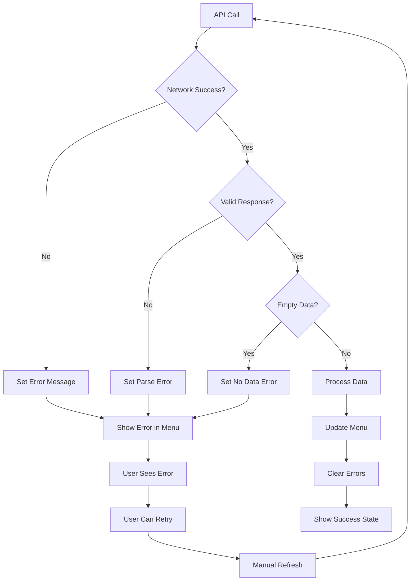
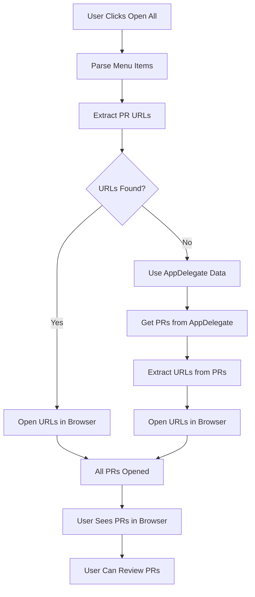
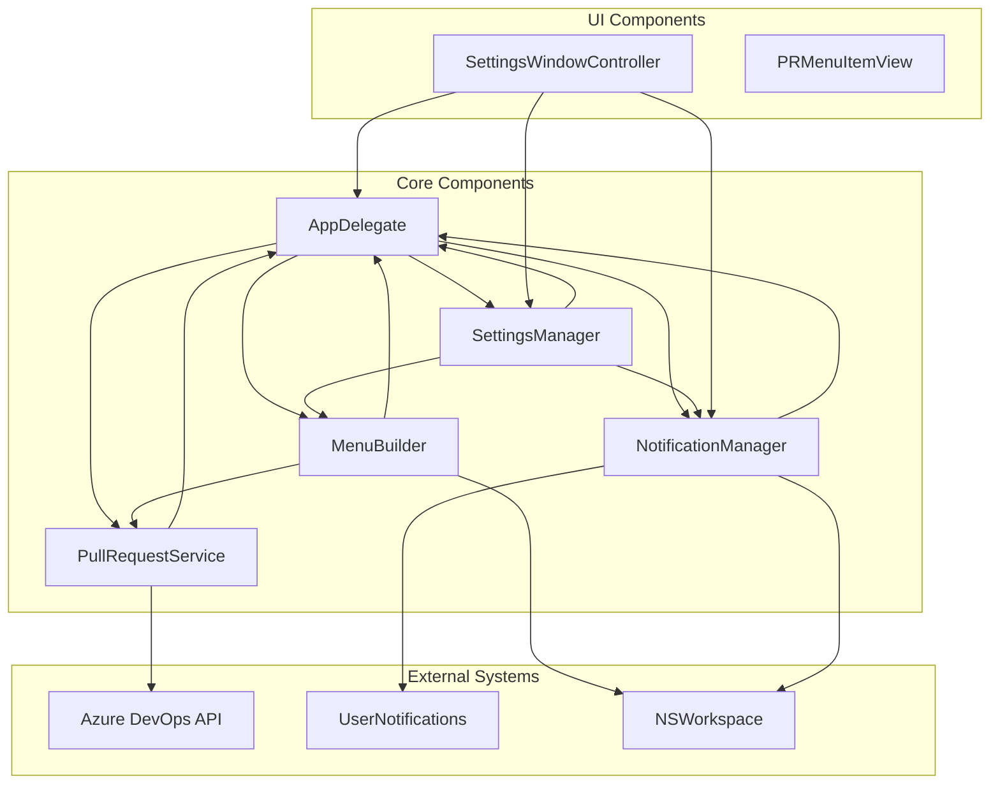
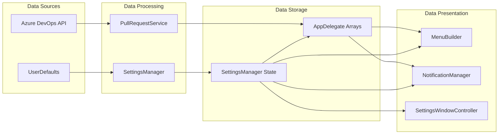

# Flow Diagrams

## Application Startup Flow

## Data Fetching Flow

## Menu Construction Flow

## Notification Flow

## Settings Update Flow

## Error Handling Flow

## Batch Operation Flow

## Component Interaction Flow

## Data Flow Architecture

